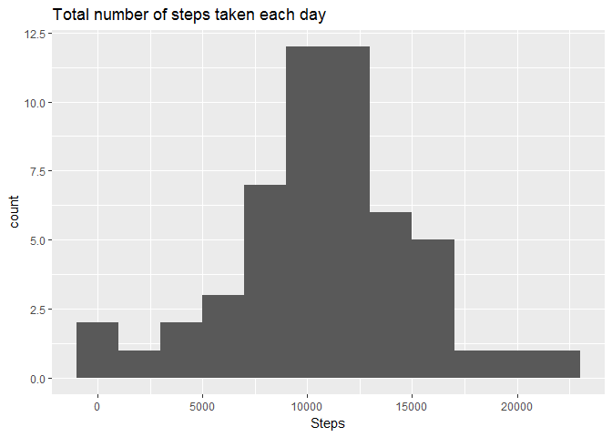
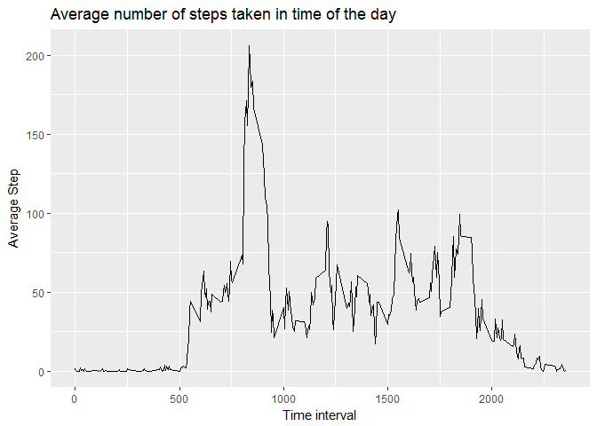

# Reproduciable Research PA1
Thomas Yeung  
May 6, 2017  


#Introduction
This assignment makes use of data from a personal activity monitoring device. This device collects data at 5 minute intervals through out the day. The data consists of two months of data from an anonymous individual collected during the months of October and November, 2012 and include the number of steps taken in 5 minute intervals each day.

The data for this assignment can be downloaded from the course web site:

Dataset: [Activity monitoring data](https://d396qusza40orc.cloudfront.net/repdata%2Fdata%2Factivity.zip)

The variables included in this dataset are - 

1. steps: Number of steps taking in a 5-minute interval (missing values are coded as NA)
2. date: The date on which the measurement was taken in YYYY-MM-DD format
3. interval: Identifier for the 5-minute interval in which measurement was taken

##Setting the environment for knitr, and load the required package for the analysis
Frist step to set up the environment of knitr to make sure all the code are shown in the markdown file. 


```r
knitr::opts_chunk$set(echo = TRUE)
```

Next, load the packages that are required in the analysis

```r
library(dplyr)
library(ggplot2)
```

##Download the file and tidy the dataset for analysis
The file is going to be downloaded from the URL and stored as temporary file. The code will unzip the file and read the .csv file. The data will be labled as dataset. 


```r
fileurl <- "https://d396qusza40orc.cloudfront.net/repdata%2Fdata%2Factivity.zip"
temp <- tempfile()
download.file (fileurl, temp) # save tge file into temp file
dataset <- read.csv(unzip(temp), na.strings = "NA")
unlink (temp) #unlink the temp file with the zip
rm (temp) # remove temp from the object list
```

The variable 'date' is re-formatted. 

```r
lct <- Sys.getlocale("LC_TIME"); Sys.setlocale("LC_TIME", "C")
dataset$date <- as.character(dataset$date)
dataset$date <- as.Date (dataset$date, format = "%Y-%m-%d")
Sys.setlocale("LC_TIME", lct)
rm (lct)
```

At this stage, the file is loaded into r as a data frame, and the formmat is fixed for further analysis. 

##Part 1: What is mean total number of steps taken per day?
For this part of the assignment, you can ignore the missing values in the dataset.

###Step 1: Calculate the total number of steps taken per day
A new data frame is created with the name of `stepperday` with the following code. The first few line of the data frame is printed. 


```r
stepperday <- dataset %>% filter (!is.na (steps)) %>% group_by(date) %>% summarize (steps = sum(steps))
head (stepperday)
```

```
## # A tibble: 6 × 2
##         date steps
##       <date> <int>
## 1 2012-10-02   126
## 2 2012-10-03 11352
## 3 2012-10-04 12116
## 4 2012-10-05 13294
## 5 2012-10-06 15420
## 6 2012-10-07 11015
```

###Step 2: make a histogram of the total number of steps taken each day
The histogram is made with the binwidth setting at 2000. 


```r
qplot(stepperday$steps, geom = 'histogram', xlab = "Steps", main = "Total number of steps taken each day", binwidth = 2000)
```

<!-- -->

###Step 3: Calculate and report the mean and median of the total number of steps taken per day
It is done by the following code:

```r
meanperday <- mean (stepperday$steps)
```

```r
medianperday <- median (stepperday$steps)
```

The mean of number of steps taken per day is 10766.2 and the median is 10765. 

##What is the average daily activity pattern?
In this part of calculation, the missing values are ignored as the previous step. A new data set is created by calculating the average step of each time interval, across the days. The new data set is named as 'averagestep'. The following is the r code:


```r
averagestep <- dataset %>% filter (!is.na(steps)) %>% group_by (interval) %>% summarize (averagestep = mean(steps))
```

###Step 1: Plotting
Make a time series plot (type = 'l') of the 5-minute interval (x-axis) and the average number of steps taken, average across all days (y-axis). The plot is


```r
qplot (averagestep$interval, averagestep$averagestep, geom = 'line', xlab = "Time interval", ylab = "Average Step", main = "Average number of steps taken in time of the day")
```

<!-- -->

###Step 2: Looking for the max time interval
The time interval that with the maximum average step could be found by `which.max` function. 


```r
max <- averagestep [which.max(averagestep$averagestep), ]
```

From the function, the maximum time interval is 835 and the average step is 206.2.

##Part 2: Imputing missing values
Note that there are a number of days/intervals where there are missing values (coded as NA). The presence of missing days may introduce bias into some calculations or summaries of the data. By using the following code: 


```r
sum (is.na(dataset$steps))
```
we can find that there are 2304 in the dataset. 

###Step 1: Determining a strategy to inputing the missing values
In this case, the average step of the 5-min interval across all days are used to replace the missing values. A new dataset `completedataset` is created. 


```r
completedataset <- dataset
completedataset <- dataset %>% group_by(interval) %>% mutate (steps = ifelse(is.na(steps),mean(steps, na.rm = TRUE), steps))
```

By using

```r
sum(is.na(completedataset))
```

```
## [1] 0
```

All missing values are replaced. 

###Step 2: Make a histogram of the total number of steps taken each day
We first using the new dataset to calculate the total step per day. A new data frame is named `completestepperday`. 

```r
completestepperday <- completedataset %>% group_by(date) %>% summarise (steps = sum(steps))
```

Then the histogram is plotted. 

```r
qplot(completestepperday$steps, geom = 'histogram', xlab = "Steps", main = "Total number of steps taken each day (missing data replaced)", binwidth = 2000)
```

<!-- -->

###Step 3: claculate and report the mean and median total number of steps taken per day
The mean and median is calculated by

```r
mean(completestepperday$steps)
median(completestepperday$steps)
```

The maan and median are 10766.2 and 10766 respectively. 

Comparing to Part 1, by ignoring the missing data, the mean and median are 10766.2 and 10765 respectively. 

Thus, imputing missing data create minimum effect on the mean and median of total steps per day. 

##Part 3: Comparing Weekend and Weekday
In the following session, the average steps of weekend and weekday are compared to look for different in activity level between weekend and weekday. 

The `weekday()` is used in this session. And the dataset with fill-in missing values is used. 

###Step 1: Creating a new vriables to specify weekend and weekday
The variable `daytype` is created and add to the dataset with fill-in missing values (i.e. `completedataset`). THe first few line of the dataset is shhwon. 


```r
completedataset <- completedataset %>% mutate (daytype = ifelse (
        (weekdays(date)=="Saturday" | weekdays(date)=="Sunday"), "Weekend", "Weekday"
        ))
completedataset$daytype <- as.factor(completedataset$daytype)
head(completedataset)
```

```
## Source: local data frame [6 x 4]
## Groups: interval [6]
## 
##       steps       date interval daytype
##       <dbl>     <date>    <int>  <fctr>
## 1 1.7169811 2012-10-01        0 Weekday
## 2 0.3396226 2012-10-01        5 Weekday
## 3 0.1320755 2012-10-01       10 Weekday
## 4 0.1509434 2012-10-01       15 Weekday
## 5 0.0754717 2012-10-01       20 Weekday
## 6 2.0943396 2012-10-01       25 Weekday
```


###Step 2: Make a panel plot and calculate average 
Make a panel plot containing a time series plot (i.e. type = "l") of the 5-minute interval (x-axis) and the average number of steps taken, averaged across all weekday days or weekend days (y-axis). The following is the code.


```r
# creating a new dataset that calculate average steps of each interval of weekday and weekend
stepperinterval <- completedataset %>% group_by(interval, daytype) %>% summarize (steps = mean(steps))

# plot the graph
ggplot (data=stepperinterval, aes(interval, steps)) + geom_line() + facet_grid(daytype~.)
```

<!-- -->

```r
#the average number of steps for each interval taken on weekend and weekday is calculated and compared
stepperinterval %>% group_by(daytype) %>% summarize (mean(steps))
```

```
## # A tibble: 2 × 2
##   daytype `mean(steps)`
##    <fctr>         <dbl>
## 1 Weekday      35.61058
## 2 Weekend      42.36640
```


